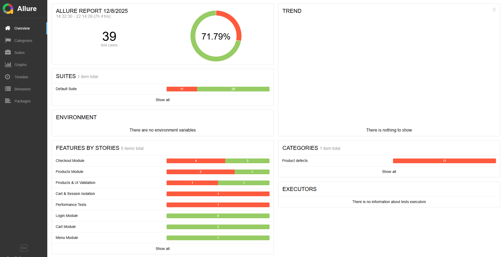
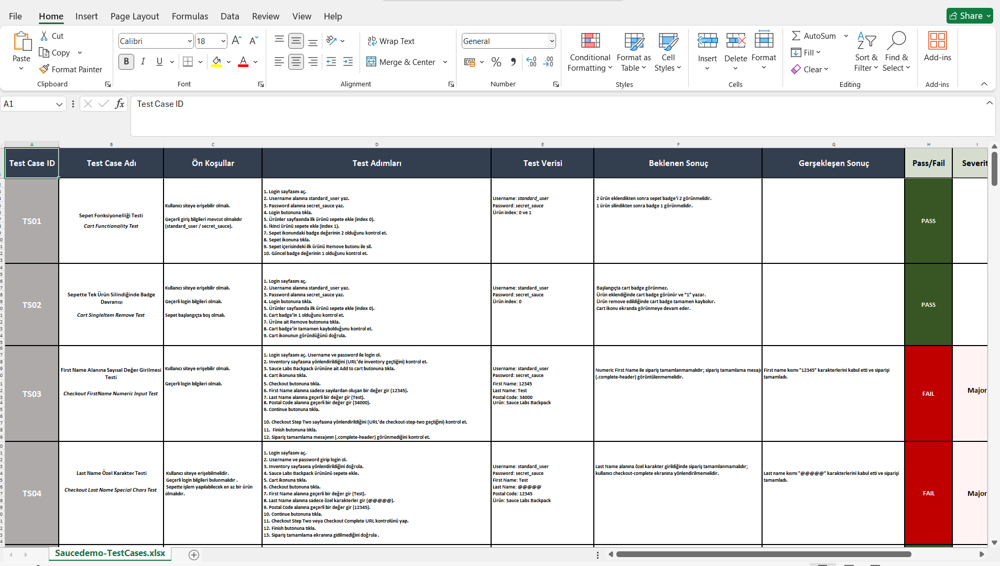

# Saucedemo Automation Framework

Selenium + TestNG automation framework for [Saucedemo](https://www.saucedemo.com),  
built with Page Object Model (POM), Allure reporting, video recording and parallel execution.

---

## 🏷 Badges


---

## 🚀 Overview

This repository contains an end-to-end UI automation framework for **Saucedemo**.

Main goals:

- Clean & scalable architecture (**Page Object Model – POM**)
- Highly readable test scenarios with Allure `@Epic / @Feature / @Story`
- Parallel execution support (TestNG)
- Rich Allure HTML reports
- Video recording for each test run
- Reusable utilities & listeners

---

## ✨ Features

- ✔️ **Selenium WebDriver 4**
- ✔️ **TestNG** test runner
- ✔️ **POM (Page Object Model)** structure
- ✔️ **Allure reporting integration**
- ✔️ **Video recording** (Monte Screen Recorder)
- ✔️ **Parallel execution support**
- ✔️ **Reusable utilities, base classes and listeners**

---

## 📁 Project Structure

```text
Saucedemo-Automation-Framework
│
├─ saucedemo-automation-framework
│  └─ src
│     └─ test
│        └─ java
│           ├─ base
│           ├─ pages
│           ├─ tests
│           └─ utilities
│
├─ test-output/
├─ test-recordings/
├─ target/
├─ allure-report/
├─ allure-report-overview.png
└─ run-allure.bat
```

## 🧪 Example Allure Report
Screenshot from a sample test run:


To view the live report locally: http://127.0.0.1:62089/#

bash
copy code
```allure serve target/allure-results```

## 🛠 Installation


1️⃣ Clone the project

git clone https://github.com/PELIN-ERMISKET/Saucedemo-Automation-Framework.git

```cd Saucedemo-Automation-Framework/saucedemo-automation-framework```

2️⃣ Install dependencies

```Maven will automatically download all required dependencies on the first run.```

▶️ Running Tests

Run the full default test suite:

```mvn clean test```


Run tests in parallel mode:

```mvn clean test -DsuiteXmlFile=testng-parallel.xml```

## 📊 Allure Reporting
Generate & open Allure report (CLI)

bash
copy code
```allure serve target/allure-results```
Or via helper .bat file
From the project root:


bash
copy code
```run-allure.bat```
This will generate and open the latest Allure report in your default browser.

## 📊 Allure Report (Full Screenshots)

You can view the full Allure report screenshots here:  
➡ [Allure Report Screenshots](allure-report-screenshots/)


## 🎥 Test Execution GIF (Checkout Flow)

A sample test execution recording is shown below.  
This GIF demonstrates the full checkout flow using the Visual User scenario.

[Checkout Test Video](saucedemo-automation-framework/test-recordings/TestRecording_checkout-MP4.mp4)

## 📊 Test Case Documentation Preview 

The image below shows the PNG preview of the full test case documentation.  
You can download the complete Excel file using the link below:

➡️ **[Download Excel Test Cases](saucedemo-automation-framework-Test-Cases.xlsx)**  
➡️ **[Open PNG Preview](saucedemo-automation-framework-Test-Cases.png)**  

<p align="center">
  
</p>


